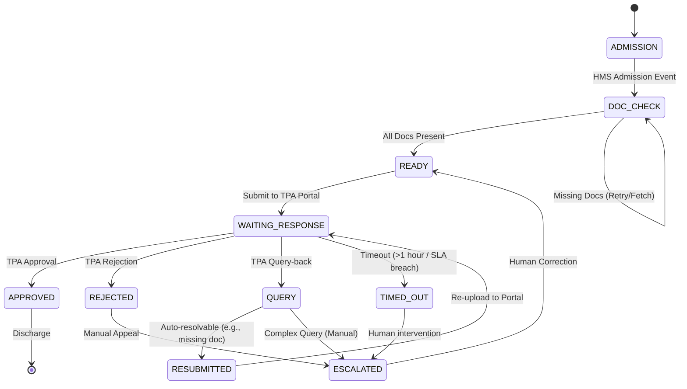

# Architecture Document: AI Insurance Agent

## 1. Problem Framing
The current billing process at the 80-bed hospital is heavily manual, leading to significant inefficiencies:
- **Operational Lag:** Average response time is 2.4 hours, failing the IRDAI 1-hour mandate.
- **Financial Leakage:** 11% rejection and 22% query-back rates indicate poor initial submission quality.
- **Patient Experience:** 18% of patients face discharge delays due to pending approvals.
- **Complexity:** Different payers (Star Health, Medi Assist, Paramount, CGHS) use fragmented communication channels (API, Portal, Email, Phone, Physical Forms).

**Solution:** The AI Agent acts as a "Unified Submission Layer" that:
1. **Orchestrates** the workflow from admission to discharge via a state machine.
2. **Automates** document completeness checks before submission.
3. **Interfaces** with various TPA endpoints (API or Mocked Portal/Email).
4. **Reasons** about TPA queries to auto-resolve routine issues or escalate complex clinical queries.

## 2. State Machine (Medi Assist Case)
The following state machine models the lifecycle of a Medi Assist case:

## 3. Guardrails
| Action | Autonomous (Agent) | Human Required | Rationale |
| :--- | :---: | :---: | :--- |
| Document Completeness Check | ✅ | | Purely rule-based verification. |
| Initial Submission | ✅ | | Standardized data entry task. |
| Auto-resolving "Missing ID" | ✅ | | Low-risk, programmatic retrieval. |
| Responding to Medical Queries | | ✅ | Requires clinical judgment and liability. |
| Appealing a Rejection | | ✅ | Strategic decision; requires negotiation. |
| Final Discharge Approval | | ✅ | Financial sign-off; high-stakes action. |

## 4. Stack and Why
- **Python / FastAPI:** High-performance, asynchronous framework ideal for handling concurrent I/O.
- **Ollama (qwen2.5-coder:1.5b-base):** Local LLM integration for privacy-compliant clinical data reasoning and intent extraction.
- **SQLAlchemy:** Robust ORM for state persistence, ensuring cases aren't lost on restart.
- **Logging (Native):** Provides the required audit trail for IRDAI compliance and debugging.
- **Pydantic:** Strict data validation to ensure submission quality and reduce rejection rates.
