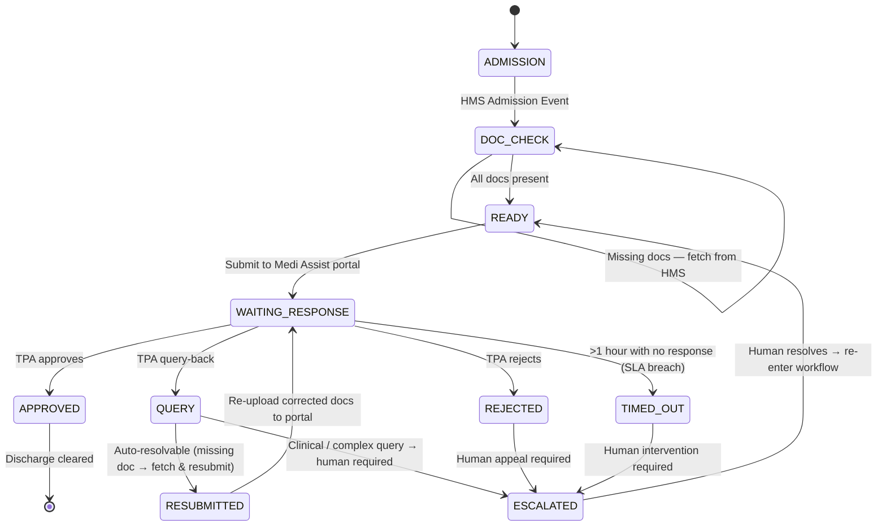

# Architecture Document: AI Insurance Agent

## 1. Problem Framing

An 80-bed hospital on OMR, Chennai processes ~30 admissions per day. A five-person billing team handles cashless insurance pre-authorizations entirely by hand — submitting forms, following up on approvals, and responding to TPA queries across portals, email, WhatsApp, and phone. The result is predictable:

- **SLA Breach:** IRDAI mandates a 1-hour first response. The team averages 2.4 hours.
- **High Rejection Rate (11%):** Incomplete or incorrectly formatted submissions are rejected outright, requiring manual rework and resubmission.
- **High Query-Back Rate (22%):** TPAs frequently ask for missing documents or clarifications, each of which requires a human to read, interpret, retrieve the document, and resubmit — a cycle that can take hours.
- **Discharge Delays (18%):** Patients who are medically ready to leave wait because their insurance approval is still pending.

The root cause is not the billing team's competence — it is the **fragmented, manual nature of the payer interfaces**. The hospital deals with six payers, and each one works differently:

| Payer | Submission Channel | Response Channel | Automatable? |
|:---|:---|:---|:---|
| Star Health | REST API | REST API | Fully |
| Medi Assist | Web portal | Portal + Email | Mostly (needs scraping/polling) |
| Paramount | Email | Phone only | Partially (submit only) |
| CGHS | Physical forms | Physical letter / phone | Minimally (pre-fill forms only) |

No single integration strategy covers all six payers. The billing team is effectively acting as a **human middleware layer**, translating between the hospital's HMS and each payer's unique interface.

**What the agent needs to do:** Replace this human middleware with a software agent that:
1. **Triggers automatically** on admission events from the HMS.
2. **Validates document completeness** before submission, flagging (not hiding) gaps.
3. **Submits through the correct channel** for each payer (API call, portal automation, email, or flagging for manual submission).
4. **Monitors for responses** and handles routine query-backs autonomously (e.g., "missing ID proof" → fetch and resubmit).
5. **Escalates to humans** for anything it cannot safely handle: clinical queries, rejections requiring appeal, and payers with no digital response channel.
6. **Tracks the IRDAI SLA clock** and alerts when a case is approaching the 1-hour deadline.

## 2. State Machine (Medi Assist Case)

The following state machine models a single Medi Assist case from HMS admission to discharge. It covers the happy path (direct approval), the query-back path (TPA asks for more info), the rejection path, and the timeout path (SLA breach).

**Key transitions:**
- **DOC_CHECK → DOC_CHECK:** The agent retries fetching missing documents from the HMS. After a configurable number of retries, it escalates.
- **QUERY → RESUBMITTED vs ESCALATED:** The agent uses an LLM to classify the TPA's query. If it's a document request ("upload diagnosis report"), the agent auto-resolves. If it's a clinical question ("justify the need for surgery"), it escalates to a human.
- **TIMED_OUT / REJECTED → ESCALATED:** These are irreversible states from the agent's perspective. Only a human can re-enter the workflow.
- **ESCALATED → READY:** After human intervention (e.g., appeal filed, clinical info provided), the case re-enters the submission pipeline.

## 3. Guardrails

| Action | Agent (Autonomous) | Human Required | Rationale |
|:---|:---:|:---:|:---|
| Document completeness check | ✅ | | Rule-based: compare available docs against payer-specific requirements. |
| Fetching missing docs from HMS | ✅ | | Programmatic retrieval — no judgment needed. |
| Initial submission to TPA | ✅ | | Standardised data entry. Agent follows the payer adapter's channel. |
| Auto-resolving "missing document" queries | ✅ | | Low-risk: fetch document, resubmit. Reversible. |
| Interpreting clinical queries from TPA | | ✅ | Requires medical knowledge and carries liability. |
| Appealing a rejection | | ✅ | Strategic negotiation — cannot be undone if handled poorly. |
| Modifying treatment cost estimates | | ✅ | Financial commitment — irreversible once submitted. |
| Final discharge clearance | | ✅ | Financial sign-off with real-money implications. |
| CGHS physical form submission | | ✅ | Agent can pre-fill; human must physically submit. |

**Principle:** The agent handles anything that is **rule-based, reversible, and low-risk**. Anything involving **clinical judgment, financial commitment, or irreversible external communication** requires a human in the loop.

## 4. Stack and Why

**Python / FastAPI** for the backend — async-native, fast enough for I/O-bound TPA polling, and the team can read and modify it without a steep learning curve. **SQLAlchemy + SQLite** for state persistence so that cases survive restarts and every state transition is auditable. **Ollama (local LLM)** for the reasoning step — the agent uses a locally-hosted LLM to classify free-text TPA queries into actionable intents (auto-resolve vs. escalate), which is the core "intelligence" that separates this from a dumb rule engine. Running inference locally via Ollama avoids sending patient data to external APIs, which matters for healthcare compliance. **Python's built-in logging** provides the timestamped audit trail required for IRDAI compliance. The **payer adapter pattern** (`BasePayer` → per-payer implementations) keeps the agent's state machine payer-agnostic — adding a new payer means writing one new adapter class, not touching the core workflow.
